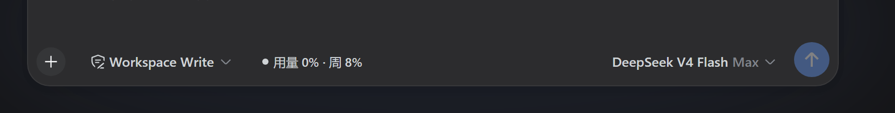
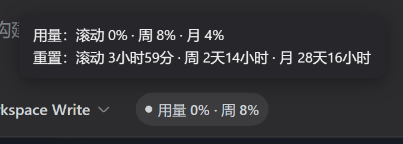

# opencode-usage-badge

[DeepSeek Harness](https://deepseek-harness.github.io/deepseek-harness/)（DSH）Web UI 插件：在输入框左侧（模型选择器旁）显示 **opencode go 用量徽章**——滚动 / 周 / 月三个时间窗的用量百分比，悬停显示各窗口的重置倒计时。

本插件是从 [dsh-utils](https://github.com/jifeilong9/dsh-utils) 中单独拆出的用量徽章部分，安装方式与行为完全一致，不包含文件管理器等其他功能。

## 效果预览



徽章显示在输入框工具行、模型选择器左侧：`● 用量 {滚动}% · 周 {周}% · 月 {月}%`。点击徽章立即刷新，每 10 分钟自动轮询。



悬停徽章显示滚动 / 周 / 月三个窗口的重置倒计时（如 `4小时7分`、`6天22小时`），用量百分比已在徽章本体展示，不再重复。

## 功能特性

- **显示条件**（满足其一即显示，其他模型自动隐藏）：
  1. 当前会话模型的 **provider id 为 `opencode-go`**（可通过配置 `providerId` 修改）
  2. 或该 provider 在模型配置里声明的 **baseURL 指向 `https://opencode.ai/zen/go`**（可通过配置 `baseUrlPrefix` 修改；host 端判定，兼容任意 provider 键名）
- **自动轮询**：每 10 分钟拉取一次用量，点击徽章立即刷新（强制绕过缓存）
- **全局共享**：用量按 provider 在 host 端全局缓存（默认 5 分钟，可配置 `cacheTtlMs`），多会话/多标签共用同一份报告，切换会话即时显示、不再重复请求
- **悬停提示**：滚动 / 周 / 月三个窗口的重置倒计时（用量已在徽章本体显示）
- **颜色预警**：`<70%` 正常 · `70–89%` 橙色 · `≥90%` 红色
- **断网兜底**：请求失败自动重试（3 次），仍失败时回退显示上次成功数据并标注"缓存数据"

## 安装

```sh
# 本地 tarball（构建产物）
dsh plugin --profile web add ./opencode-usage-badge-0.1.3.tgz

# 发布到 npm 后
dsh plugin --profile web add opencode-usage-badge
```

安装后**重启 `dsh web`**，模型选择器旁出现用量徽章即生效。

> 首次安装若提示 `ERR_PNPM_IGNORED_BUILDS`，把 pnpm 打印的包键加入 profile 的 `pnpm-workspace.yaml` 的 `allowBuilds` 后重新执行即可。

## 工作原理：API Key 解析（不内嵌任何 Key）

插件包内**不包含任何 API Key**，运行时按以下链路解析（与模型路由共用同一份配置）：

1. 模型配置 `llm-pi-ai.providers.<provider>.apiKeyEnv` 声明的**引用名**（如 `OPENCODE_GO_API_KEY`）
2. 该引用通过 DSH 凭据服务解析（web 的 Models 页面写入 `~/.dsh/.credentials.yaml`）
3. 环境变量兜底

也就是说，只要你的 DSH 已经在用 opencode go 模型（settings 文档里有 `llm-pi-ai.providers.opencode-go.apiKeyEnv` 且凭据可用），装完插件即可直接显示，无需任何额外配置。

非常规部署可通过 profile patch 覆盖：

```yaml
# ~/.dsh/profiles/web/cordis.patch.yml
- id: opencode-usage-badge
  config:
    apiKey: sk-...      # 可选：覆盖模型配置查找
    endpoint: https://opencode.ai/zen/go/v1/usage  # 可选：默认即此地址
    providerId: opencode-go   # 可选：默认即此值；provider 键名不同时改成自己的
    baseUrlPrefix: https://opencode.ai/zen/go  # 可选：默认即此前缀；baseURL 匹配前缀
    cacheTtlMs: 300000  # 可选：用量全局缓存毫秒数，默认 5 分钟
```

### 对方 provider 键名不是 opencode-go 时

两种方式任选其一：

1. **配 baseURL**（推荐）：在对方的 `llm-pi-ai.providers.<provider>` 里声明 `baseURL: https://opencode.ai/zen/go/v1`（非 pi-ai 内置 catalog 的 provider 还需要 `api: openai-completions` 之类的协议字段），插件自动识别为 opencode；
2. **改 providerId**：在上面的 patch 里把 `providerId` 改成对方的 provider 键名。

## 开发与构建

```sh
npm install        # 安装构建依赖（esbuild，仅开发用）
node build.mjs     # 构建 client bundle（src/client.js → lib/client.js）
npm pack           # 打包 tarball
```

### 目录结构

```
├── assets/         # 文档截图
├── src/            # client 源码（浏览器端，esbuild 构建）
├── lib/            # 构建产物
│   ├── index.js    # host 端：usageBadge Typert Remote（用量查询 + Key 解析）
│   └── client.js   # client 端：用量徽章（轮询、倒计时、缓存兜底）
├── build.mjs       # client 构建脚本
├── cordis.patch.yml
├── dsh.plugin.json
└── package.json
```

## 免责声明

- 徽章从 `https://opencode.ai/zen/go/v1/usage` 读取数据（通过 host 端代理，**Key 不进入浏览器**）
- 与 opencode 服务无官方关联，端点或字段变更可能导致功能失效
- 本插件按 MIT 协议开源，使用风险自负
